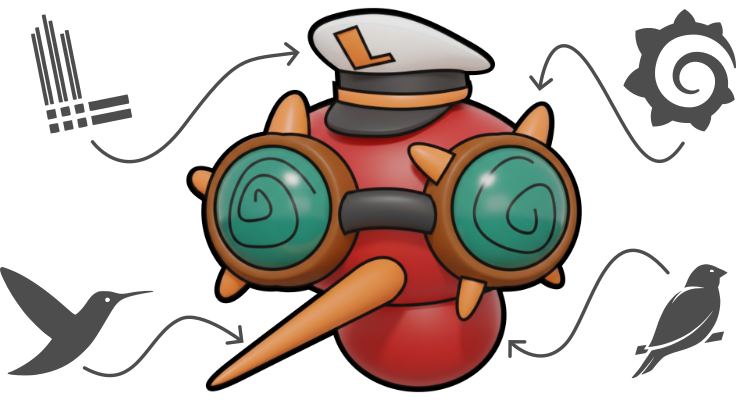
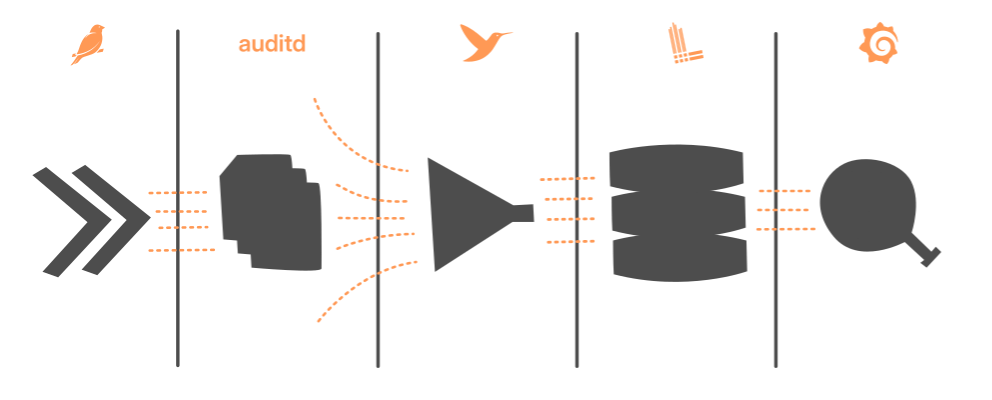
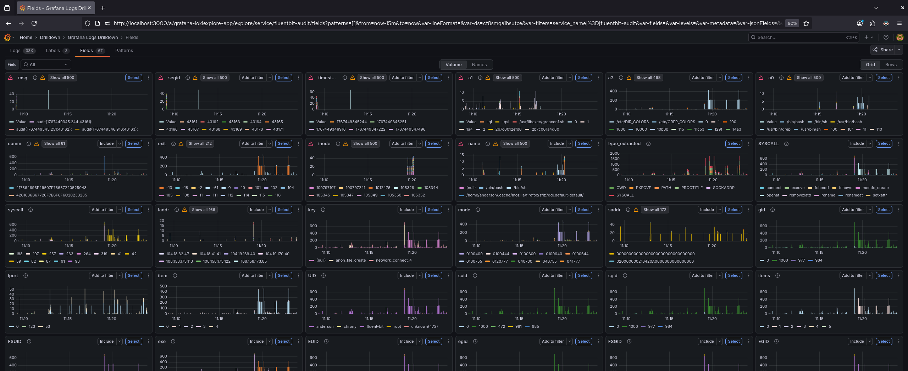

# Atomic, auditd, Fluentbit, Loki, Grafana
A fully open-source security stack for detecting Atomic Red Team simulations. Using Fluentbit, Loki, and Grafana to transform auditd logs into adversary insights.

## Stack Overview

| Component  | Description |
|------------|-------------|
| **Atomic** | Atomic Red Team is a library of simple tests that every security team can execute to test their controls. |
| **auditd** | Linux kernel auditing framework used to capture security-relevant system events generated by Atomic Red Team executions. |
| **Fluentbit** | Lightweight telemetry pipeline that collects, parses, enriches, and labels auditd events before forwarding them to Loki. |
| **Loki** | Log aggregation and query engine optimized for high-cardinality security telemetry using LogQL. |
| **Grafana** | Visualization and alerting layer used to monitor Atomic Red Team activity and validate detection coverage in near real time. |

## Screenshots
The screenshot below highlights the Grafana Explore interface, which provides full visibility into auditd events ingested into Loki. 

This view enables fast detection tuning and exploratory analysis, making it easier to understand complex behaviors and transform raw telemetry into reliable detections.

## Quick Start
todo
